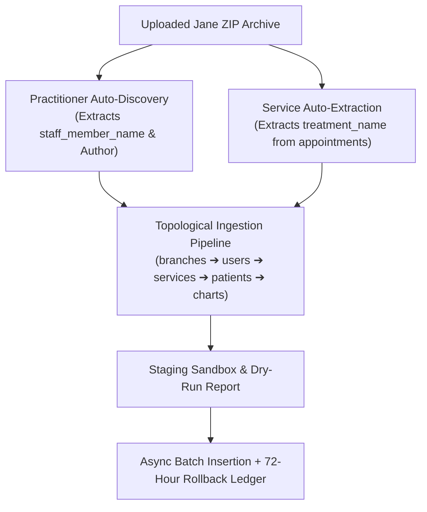

# ADR-005: Jane App Automated Data Migration Engine Architecture

**Date:** September 2026  
**Status:** Accepted (Specified in EPIC-10, Migrations `00109`–`00111`)  
**Context Source:** `clinic-app/ai-toolkit/ROADMAP_JANE_DATA_MIGRATION_EPIC.md`  

---

## 1. Context & Problem Statement
Clinics migrating from Jane App need to import thousands of legacy records (Patients, Appointments, Clinical SOAP Charts) into our platform without data loss, downtime, or corrupting pre-existing clinic records. Jane App exports do not include a standalone `staff.csv` or `services.csv`.

---

## 2. Decision Outcome
We engineered a **5-Stage Asynchronous Ingestion Engine** with dual **Auto-Discovery Engines**:

---

## 3. Core Database Schemas
- `data_migration_jobs`: Job tracking, status (`PENDING`, `UPLOADING`, `VALIDATING`, `DRY_RUN_COMPLETE`, `MIGRATING`, `COMPLETED`, `ROLLED_BACK`), and 72-hour rollback timestamps.
- `migration_entity_mappings`: Relational identity ledger linking Jane source GUIDs (`20111-1350`) to internal PostgreSQL UUIDs.
- `patient_charts`: Stores historical SOAP notes and clinical chart entries.

---

## 4. Consequences & Benefits
- **Loss-less Auto-Discovery:** Discovers practitioners and services directly from appointment logs even when standalone CSVs are omitted.
- **72-Hour Transactional Rollback:** Allows complete one-click reversal without mutating non-migrated clinic data.
