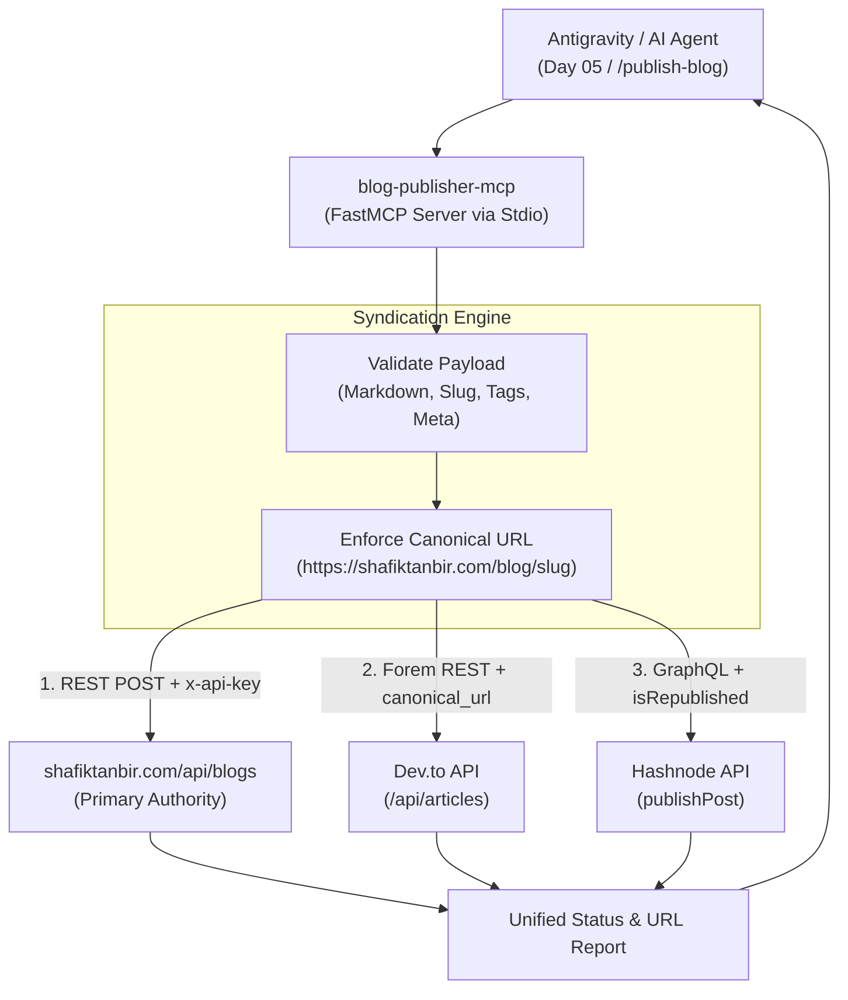

# ADR-019: Blog Cross-Publisher MCP Engine & Canonical Authority Syndication

* **Status:** Accepted  
* **Date:** 2026-10-04  
* **Authors:** Shafikul Islam, Senior Backend & Cloud Infrastructure Architect  
* **Context:** Day 05 Multi-Platform Syndication, Model Context Protocol (MCP), SEO & GEO Link Equity Preservation  

---

## 🎯 Context & Problem Statement

To maximize inbound discovery across both traditional search engines (Google) and Generative Engine Optimization / LLM platforms (ChatGPT, Perplexity, Claude, SearchGPT), engineering case studies must be distributed across high-authority developer networks:
1. **Primary Domain:** `https://shafiktanbir.com/blog/` (authoritative home).
2. **Dev.to:** High developer engagement and fast Google crawler indexing.
3. **Hashnode:** Strong domain authority and active engineering reader graph.

However:
- **Duplicate Content Penalties:** Syndicating identical markdown across multiple domains without strict `canonical_url` attribution fractures domain authority and risks algorithmic downgrading.
- **Manual Overhead:** Manually formatting tags, cover images, and frontmatter across three disparate dashboards burns valuable execution time during client acquisition sprints.
- **Lack of Agent Tooling:** Antigravity and AI agents lacked a unified tool to broadcast articles programmatically with guaranteed canonical backlinking.

---

## 💡 Decision Drivers

* **Zero SEO Equity Loss:** Every syndicated article on Dev.to and Hashnode must programmatically enforce `canonical_url: "https://shafiktanbir.com/blog/<slug>"`, ensuring 100% of search ranking and backlink credit flows to Shafikul's personal domain.
* **Autonomous Agent Ergonomics:** Provide a single Model Context Protocol (MCP) tool call (`publish_cross_platform`) allowing agents or CLI scripts to syndicate an article to all three destinations simultaneously.
* **Resilient Graceful Degradation:** If credentials for one platform (e.g., Hashnode or Dev.to) are missing or in draft status, the engine must still successfully publish to available destinations without failing the entire batch.

---

## 🏛️ Architecture & System Changes

### 1. Dedicated MCP Server (`blog-publisher-mcp`)
Built on Python's `mcp` SDK using standard IO (stdio) transport:
- Exposed Tools:
  - `publish_cross_platform`: Parallel syndication to all 3 endpoints.
  - `publish_to_portfolio`: Direct REST dispatch to Next.js `/api/blogs`.
  - `publish_to_devto`: Forem API integration with `canonical_url`.
  - `publish_to_hashnode`: GraphQL v2 mutation with `isRepublished` attribution.
  - `verify_publisher_credentials`: Diagnostic connectivity validation.

### 2. Standardized Configuration
- Configured in `~/.gemini/config/mcp_config.json` and `~/.gemini/antigravity/mcp_config.json`.
- Environment credentials managed via `.env`:
  - `PORTFOLIO_API_KEY`: Secret header authentication (`shafik-secret-admin-key-2026`).
  - `DEVTO_API_KEY`: Forem community access token.
  - `HASHNODE_ACCESS_TOKEN` & `HASHNODE_PUBLICATION_ID`: Hashnode developer token and publication identifier.

### 3. Roadmap & Daily Plan Integration
- Created [`next-move/daily/day-05-plans/01-blog-cross-publisher-mcp-plan.md`](file:///home/shafikul/Documents/work/coding/shafik-protfolio/next-move/daily/day-05-plans/01-blog-cross-publisher-mcp-plan.md) formalizing the execution steps.
- Linked into [`next-move/daily/day-05.md`](file:///home/shafikul/Documents/work/coding/shafik-protfolio/next-move/daily/day-05.md).

---

## 📊 Consequences & Validation

* **Positive:**
  - Automated 1-click cross-publishing saves 30+ minutes per technical article.
  - 100% canonical SEO backlink preservation directs all search equity to `shafiktanbir.com`.
  - Unified JSON response provides immediate verification and live links across all 3 platforms.
* **Negative / Trade-offs:**
  - Requires maintaining API tokens across 3 separate developer settings.
  - API rate limits from Dev.to or Hashnode require retry backoff handling during burst posts.
