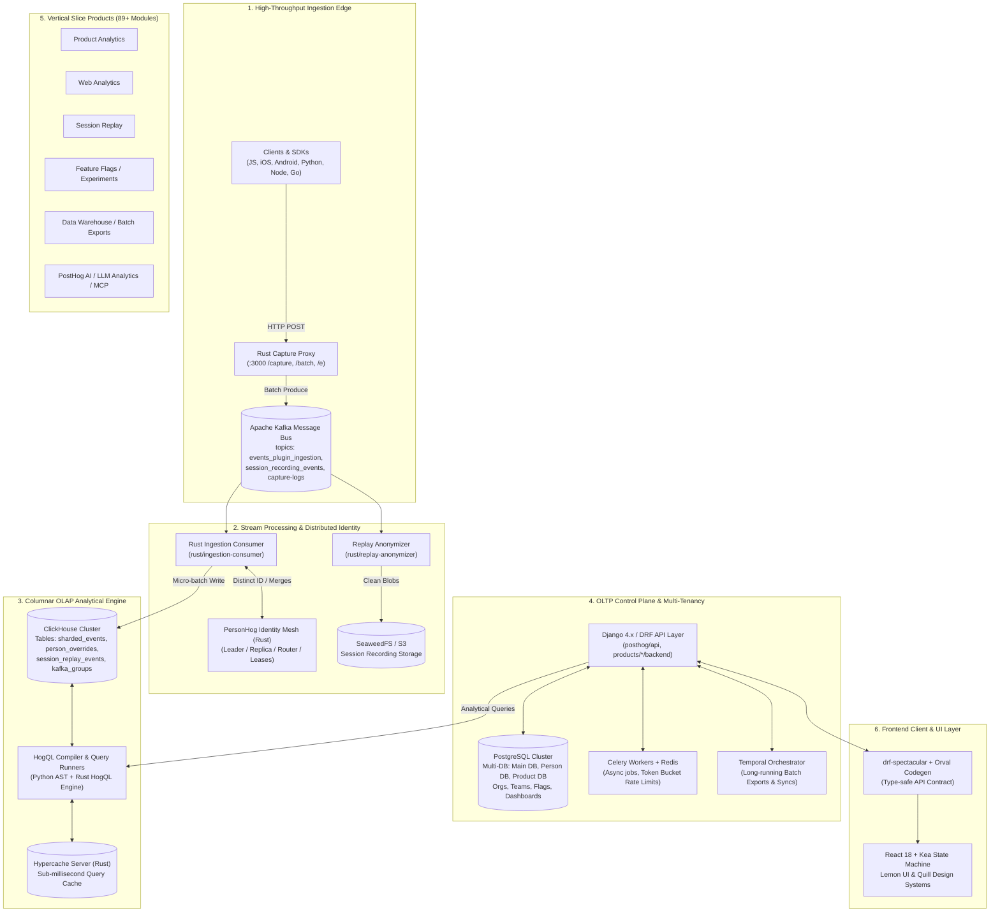

# PostHog — System Architecture & Engineering Deep Dive

> **Knowledge Base Domain:** `01-projects/posthog/`  
> **Source Codebase:** `/home/shafikul/Documents/opensource_project/posthog/`  
> **Interactive Visualizer:** [`posthog_architecture_explorer.html`](file:///home/shafikul/.gemini/antigravity/brain/ccb03712-e979-4275-9999-8d58082c3c2a/posthog_architecture_explorer.html) *(Full zoom, pan, and component drawer)*  
> **Target Audience:** Senior Systems & Backend Engineers, Open-Source Contributors  

---

## 1. High-Level Architectural Topology

PostHog is architected as an event-driven, hybrid OLTP/OLAP distributed system designed to ingest, process, and query billions of events per day. It combines a high-performance **Rust** ingestion and identity mesh, an **Apache Kafka** streaming backbone, a **ClickHouse** columnar analytical engine, a **Django/PostgreSQL** transactional control plane, and an isolated **modular product architecture**.



---

## 2. Ingestion Pipeline & Streaming Architecture

### 2.1 Edge Capture Proxy (`rust/capture/`)
The entry point for all incoming event telemetry is PostHog's Rust capture service (`rust/capture/`):
- **Ultra-Low Latency:** Implemented with Tokio, Axum, and RdKafka for near-zero memory allocation during event intake.
- **Fast Path Validation:** Validates API tokens against an in-memory/Redis cache, decompresses incoming gzip/zstandard payloads, and computes distinct ID routing keys.
- **Backpressure & Sharding:** Dispatches events to Kafka topic partitions hashed by `team_id:distinct_id` to guarantee in-order processing for individual entities.

### 2.2 Apache Kafka Topic Topology
Kafka acts as the primary shock absorber between ingestion spikes and database persistence:
- `events_plugin_ingestion`: Main event stream awaiting identity resolution and CDP transformations.
- `clickhouse_events_json`: Pre-processed events formatted for direct ClickHouse ingestion table insertion.
- `session_recording_events`: High-volume DOM mutation events, mouse movements, and console logs.
- `capture-logs` & `capture-apm-metrics`: Telemetry streaming into the APM/Log observability pipelines.

### 2.3 Session Replay Ingestion & Blob Storage
- **PII Scrubbing:** `rust/replay-anonymizer/` performs streaming regex/structural redaction of user text, passwords, and sensitive input fields directly on the Kafka event stream.
- **Object Storage:** Uncompressed recordings are persisted to **SeaweedFS** (`:19000` / `:8333`), an S3-compatible, ultra-fast distributed object store (replacing legacy MinIO configurations).

---

## 3. Distributed Identity & Person Management (`personhog`)

One of the hardest distributed systems challenges in product analytics is real-time person identity resolution—mapping multiple anonymous distinct IDs to a single canonical person across billions of events without lock contention.

### 3.1 The Rust PersonHog Architecture (`rust/personhog-*`)
PostHog decoupled identity from Django and PostgreSQL into a dedicated Rust microservice cluster:
- **`personhog-router`**: Routes identity lookup requests across distributed shards based on consistent hashing of `team_id` and `distinct_id`.
- **`personhog-identity`**: In-memory actor state machine managing distinct ID associations.
- **`personhog-leader` & `personhog-coordination`**: Raft/lease-based distributed leader election to manage partition assignments, split-brain prevention, and shard failovers.
- **`personhog-replica` & `personhog-writer`**: Manages async replication logs and commits resolved identity mappings back to Postgres override tables and ClickHouse `person_overrides`.

### 3.2 Person Data Routing Invariant
- Identity lookups **MUST** route through the personhog client (`posthog/personhog_client/`).
- Direct ORM or raw SQL queries to `posthog_person`, `posthog_persondistinctid`, or `posthog_personoverride` are strictly prohibited in application code to prevent database locking regressions.
- Person properties and rich aggregations are queried directly from ClickHouse via HogQL (`ActorsQueryRunner`).

---

## 4. Analytical Database & HogQL Query Engine

### 4.1 ClickHouse Distributed Columnar Store
- **Partitioning Strategy:** Events are partitioned by month `toYYYYMM(timestamp)` and sub-partitioned by `team_id`.
- **Engine Selection:** Uses `ReplacingMergeTree` for deduplicating events and merging person overrides, and `AggregatingMergeTree` for pre-aggregated metric rollups.
- **Sharding & Replication:** Distributed tables split across nodes with ClickHouse Keeper handling coordination.

### 4.2 HogQL: Safe, Unified Query Language
HogQL is PostHog's purpose-built query language that exposes the full power of ClickHouse SQL while enforcing security, multi-tenancy, and domain abstractions:
- **AST Parser:** Written in Python (`posthog/hogql/`) with a high-performance native parser in Rust (`rust/hogql/` and `common/hogql_parser/`).
- **Sandboxed Compilation:** Translates user HogQL queries into ClickHouse SQL, automatically injecting tenant isolation filters (`WHERE team_id = <current_team>`).
- **Virtual Schemas & Dynamic Joins:** Exposes high-level entities (e.g., `events.person.properties.$browser`, `sessions.duration`) by auto-generating complex subqueries and dictionary joins transparently.
- **HogQL Query Runners (`posthog/hogql_queries/`):**
  - `InsightActorsQueryRunner`: Resolves persons matching specific filter steps.
  - `FunnelsQueryRunner`: Computes multi-step conversion funnels using ClickHouse window functions.
  - `TrendsQueryRunner`: Time-series aggregations with interval breakdowns.
  - `RetentionQueryRunner` & `LifecycleQueryRunner`: Cohort retention matrices and user lifecycle classifications (new, returning, resurrecting, dormant).

### 4.3 Hypercache (`rust/hypercache-server/`)
A dedicated high-performance Rust caching daemon caching serialized HogQL execution plans and hot analytical query responses, reducing ClickHouse CPU load for shared dashboards.

---

## 5. OLTP Control Plane & Multi-Tenancy Architecture

### 5.1 Django Backend & PostgreSQL Multi-Database Setup
PostgreSQL serves as the ACID transactional database for all metadata:
- **Tenancy Scoping:** Every tenant model inherits from `TeamScopedRootMixin` or `ProductTeamModel`. 
- **Anti-IDOR Security Invariant:** CI linters (`idor-lookup-without-team`, `check-idor-model-coverage.py`) enforce that every tenant query includes `team_id`. Unscoped queries are rejected by default.
- **Database Routing:** `product_db_router.py` and `person_db_router.py` enable seamless routing of different products or person tables to dedicated PostgreSQL instances without application-level code modifications.

### 5.2 Distributed Resilience & Reliability
- **Token Bucket Rate Limiting:** `posthog/rate_limit.py` and `token_bucket.py` implement high-frequency distributed token-bucket rate limits backed by Redis.
- **Database Circuit Breaker:** `posthog/db_circuit_breaker.py` wraps database connection pools with atomic Redis Lua scripts (`posthog:dbcb`). If queries spike or PostgreSQL connection queues saturate, the circuit opens to fail fast and prevent thread pool exhaustion.
- **Temporal Durable Workflows (`posthog/temporal/`):** Long-running, multi-step asynchronous processes (Batch Exports to S3/Snowflake/BigQuery, external data warehouse syncing, and backfill migrations) execute as durable Temporal workflows with deterministic replay and automatic step retries.

---

## 6. Modular Product Architecture (`products/`)

PostHog is actively transitioning from a legacy Django monolith into **isolated vertical slice products**. Over 89 products currently live in `products/<product_name>/`.

### 6.1 Vertical Slice Layout
Each product is a self-contained Turborepo and Python package:
```text
products/<product_name>/
├── backend/                  # Django App
│   ├── apps.py               # AppConfig (registered in INSTALLED_APPS)
│   ├── routes.py             # register_routes(routers) auto-discovery
│   ├── models.py             # Tenant-scoped Django models
│   ├── logic.py              # Pure business logic
│   ├── facade/               # Cross-product public interface
│   │   ├── api.py            # Public facade functions
│   │   └── contracts.py      # Frozen dataclasses (DTOs)
│   ├── presentation/         # DRF views, serializers, endpoints
│   ├── tasks/                # Celery tasks
│   └── tests/                # Isolated pytest suite
├── frontend/                 # React scenes, components, Kea logics
├── manifest.tsx              # Product navigation, routes, icons
├── package.json              # Turborepo package manifest
├── mcp/                      # Model Context Protocol tools.yaml & UI apps
└── skills/                   # Agent skills for autonomous workflows
```

### 6.2 Strict Isolation Rules
- **No Internal Model Imports:** Product A **cannot** import models or internal logic from Product B.
- **Facade Contracts:** Cross-product communication must invoke the target product's `facade/api.py`, passing and returning immutable `@frozen` dataclasses from `contracts.py`.
- **Enforcement:** Enforced at build and commit time via `tach` (`tach.toml`) and `hogli product:lint --all`.

---

## 7. AI, Agent & MCP (Model Context Protocol) Ecosystem

PostHog features one of the most mature agentic AI architectures in modern enterprise software:

### 7.1 Model Context Protocol (MCP) Server & Tools
- **Unified Tool Definitions:** Each product exposes its analytical capabilities via `products/<product>/mcp/tools.yaml`.
- **Automated Generation:** MCP schemas and DRF OpenAPI serializers are generated simultaneously via `hogli build:openapi`.
- **MCP UI Apps:** Interactive micro-frontends embedded directly in AI agent chats (e.g. Claude Desktop, Antigravity) built with PostHog's compact Quill component library (`packages/quill/`).

### 7.2 AI Gateway (`PostHog/ai-gateway`)
- Transitioning from legacy Python `services/llm-gateway/` to a high-concurrency Go proxy (`PostHog/ai-gateway`).
- Handles unified LLM provider routing (Anthropic, OpenAI, local models), per-team budget enforcement, streaming response normalization, and cost attribution.

### 7.3 Evaluation Harness & Skills
- PostHog maintains end-to-end agent evaluation harnesses (`products/posthog_ai/eval_harness/`) and agent skills (`.agents/skills/`) to automate code refactoring, schema migrations, and PR reviews.

---

## 8. Frontend Architecture & Design Systems

- **State Management (Kea):** Built on top of Redux and Sagas, Kea organizes state into declarative `logics` containing `actions`, `reducers`, `selectors`, `listeners` (side effects), and `loaders` (async HTTP calls). Business logic lives strictly in Kea logics, never in React component hooks.
- **Design Systems:**
  - **Lemon UI:** Production design system used across all main web application scenes (`LemonButton`, `LemonTable`, `LemonModal`, `LemonSelect`).
  - **Quill (`packages/quill/`):** Lightweight, highly dense component system tailored specifically for the PostHog Desktop app and MCP tool mini-applications.
- **Type Safety Pipeline:** Changes to DRF serializers automatically recompile into TypeScript interfaces via `hogli build:openapi` and Orval into `frontend/src/generated/core/`. Hand-editing generated types is prohibited.

---

## 9. Developer Experience, Tooling & Workflow

- **`hogli` CLI:** Monorepo automation tool (`tools/hogli/`) handling:
  - `hogli start` / `hogli up -d`: Local multi-process orchestration.
  - `hogli test <path>`: Universal test runner detecting Pytest, Jest, Playwright, or Cargo.
  - `hogli product:bootstrap <name>`: Scaffolding new isolated vertical slice products.
  - `hogli ci:preflight`: Local verification of linters and merge invariants.
- **Flox Environment:** Hermetic developer shell providing consistent versions of Python, Node, Rust, and system dependencies.
- **Merge Queue Policy:** Trunk merge queue enforces zero-broken-master invariant. Manual `gh pr merge` is disabled.
