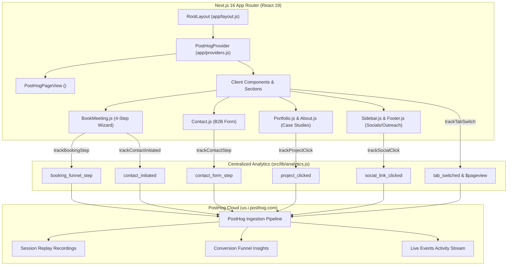

# Shafikul Islam Portfolio & B2B Telemetry Architecture (`shafik-portfolio`)

> **Host Workspace Path:** `/home/shafikul/Documents/coding/shafik-protfolio/`  
> **Production URL:** [`https://shafiktanbir.com`](https://shafiktanbir.com) / [`https://kraken.nesohq.org/`](https://kraken.nesohq.org/)  
> **Tech Stack:** Next.js 16 (Turbopack, App Router), React 19, Tailwind CSS v4, MongoDB, Docker, PostHog Analytics

---

## 🏛️ Architecture & System Design

---

## 🎯 Conversion Funnel Map

### 1. Consultation Booking Funnel
- **Step 1:** `$pageview` where `Current URL contains tab=book`
- **Step 2:** `booking_funnel_step` (`step_name = date_selected`)
- **Step 3:** `booking_funnel_step` (`step_name = time_slot_selected`)
- **Step 4:** `booking_funnel_step` (`step_name = details_submitted`)
- **Step 5:** `booking_funnel_step` (`step_name = booking_confirmed`) / `contact_initiated` (`method = form_submit`)

### 2. Contact Form Engagement Funnel
- **Step 1:** `contact_form_step` (`step_name = form_started` on input focus)
- **Step 2:** `contact_form_step` (`step_name = form_submitted` on API success)

### 3. Recruiter Outreach Funnel
- **Step 1:** `$pageview` on `/` or `tab=resume`
- **Step 2:** `resume_downloaded` or `project_clicked`
- **Step 3:** `social_link_clicked` (`platform: linkedin` or `email`)

---

## 📂 Key Architecture Files
- **Layout Provider:** [`v2/src/app/providers.js`](file:///home/shafikul/Documents/coding/shafik-protfolio/v2/src/app/providers.js)
- **Telemetry Schema:** [`v2/src/lib/analytics.js`](file:///home/shafikul/Documents/coding/shafik-protfolio/v2/src/lib/analytics.js)
- **ADR Reference:** [`knowledgebase/01-projects/adr/ADR-014-client-side-telemetry-posthog-conversion-funnels.md`](file:///home/shafikul/Documents/coding/research-playground-loop/knowledgebase/01-projects/adr/ADR-014-client-side-telemetry-posthog-conversion-funnels.md)
