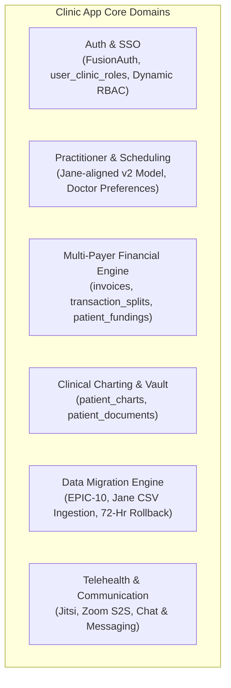

# 🏥 Clinic App — System Architecture & Technical Knowledge Base

> **Practice Management System Architecture & System Specs**  
> **Source Repository:** `/home/shafikul/Documents/office_work/clinic-app`  
> **Synced Architecture Graph:** 17,877 AST Nodes · 23,068 Dependency Edges · 55 Database Tables (Migration `00108`)

---

## 🏛️ 1. High-Level Architecture & Domain Clusters

Based on Graphify AST analysis of `clinic-app`, the system is structured into **6 Core Domain Clusters**:

---

## 🔐 2. Authentication, Multi-Tenancy & Security
* **Multi-Tenant Isolation:** PostgreSQL Row-Level Security (RLS) policies scoped by `clinic_id` (`set_clinic_context()` session configuration).
* **FusionAuth SSO Integration:** Centralized identity hub across practice management subdomains (`/s/[subdomain]`).
* **Multi-Clinic Role Junction Table (`user_clinic_roles`):** Replaced legacy `users.clinic_id` & `users.role_id` (Migration `00096`).
* **Dynamic RBAC Permission Overrides (`user_permission_overrides`):** Fine-grained per-user, per-clinic permission grants/denials (Migration `00103`).

---

## 💳 3. Multi-Payer Financial & Invoicing Engine (EPIC-08)
* **Mandatory 1:1 Meeting Invoices (`invoices`):** Binds appointments to financial ledger (Migration `00101`).
* **1:N Multi-Payer Transaction Splits (`transaction_splits`):** Splits invoice balances across insurance coverage, copays, credit cards, e-transfers, and patient direct pay.
* **Patient Fundings Registry (`patient_fundings`):** Tracks provincial government block funding (MCFD, AccessOAP), private insurance policy caps, and pre-paid package credits.
* **Insurance Claim Submissions (`funding_claim_submissions`):** Manages claim lifecycle (`draft` ➔ `submitted` ➔ `adjudicated` ➔ `paid` / `rejected`).

---

## 📥 4. Jane App Data Migration Hub (EPIC-10)
* **Pipeline Architecture:** Accepts raw Jane export bundles (`.zip` / `.csv`).
* **5-Stage Execution:**
  1. *Package Ingestion & Signature Verification* (`STORY-JDM-01`)
  2. *Schema Normalization & Phone/Date Sanitization* (`STORY-JDM-02`)
  3. *Practitioner & Service Auto-Discovery Engine* (`STORY-JDM-03`)
  4. *Patient Deduplication & Confidence Matcher* (`STORY-JDM-04`)
  5. *Non-Destructive Dry-Run Sandbox & 72-Hour Rollback* (`STORY-JDM-06` / `07` / `09`)
* **Core Schemas:** `data_migration_jobs`, `migration_entity_mappings`, `patient_charts`, `patient_documents`.
* **Universal Practitioner Detection (ADR-008):** 4-pillar cross-file heuristics across `Appointments.csv`, `Notes_Report.csv`, and `Patients.csv` (`Referred To`). Deduces supervising doctors, associate clinicians, clinical assistants (SLPAs/BIs), and administrative staff across arbitrary medical disciplines, stripping Jane asterisks (`*`) and extracting regulatory licenses (`R-SLP`, `BCBA`, `MD`).
* **Performance & TOAST Pruning (ADR-008):** Bypasses out-of-line JSONB TOAST storage in summary queries (`dataMigration.repository.ts`), cutting rollback tab latency from **1,515ms to 303ms (5x faster)**, paired with client `sessionStorage` SWR hydration for 0ms instant render.

## 📦 5. Subscription Package Control & Feature Gating (Item 19)
* **Architectural Decision:** Subscription package feature gating is managed exclusively at the **Application Layer** (`requirePlanFeature('memberships')` middleware).
* **APIs & Customizable Pricing:** The application layer exposes APIs for customizable plan pricing (`subscription_plans`). Basic plan requests return full base functionality, with advanced feature routes gated at the Express controller level.

---

## 📊 6. Reporting & Operational Analytics Architecture (EPIC-09)
* **Pillars:** Financial Summary & A/R Aging (`ST-01`), Practitioner Utilization & Capacity (`ST-02`), Cancellation & Retention Funnel (`ST-03`), and Multi-Format Async Export Engine (`ST-04`).
* **Analytical PostgreSQL Views:**
  * `v_financial_daily_summary`: Accrual-basis gross invoiced metrics.
  * `v_cash_collections_daily`: Cash-basis completed payments grouped by payment method (Stripe, MCFD, e-transfer, cash).
  * `v_accounts_receivable_aging`: 4 aging buckets (`0–30`, `31–60`, `61–90`, `90+` days) with patient vs. third-party funder separation.
* **Asynchronous Export Pipeline:** BullMQ + Redis background worker streaming QuickBooks/Xero compliant CSV/PDF reports with 24-hour tokenized download links.
* **Operational Execution (Developer B):** Dedicated claims adjudication and provincial CSV batch export (BC MCFD / AccessOAP) via [`accounts-receivable-and-claims-export-team-breakdown.md`](file:///home/shafikul/Documents/office_work/clinic-app/ai-toolkit/accounts-receivable-and-claims-export-team-breakdown.md).

---

## 📑 7. Key Documentation & Reference Links
* 📄 **Master Spec Index:** [`clinic-app/ai-toolkit/AI_TOOLKIT_INDEX.md`](file:///home/shafikul/Documents/office_work/clinic-app/ai-toolkit/AI_TOOLKIT_INDEX.md)
* 📊 **Reporting & Analytics Epic:** [`clinic-app/ai-toolkit/reporting-and-operational-analytics-epic.md`](file:///home/shafikul/Documents/office_work/clinic-app/ai-toolkit/reporting-and-operational-analytics-epic.md)
* 📋 **A/R & Claims Developer Breakdown:** [`clinic-app/ai-toolkit/accounts-receivable-and-claims-export-team-breakdown.md`](file:///home/shafikul/Documents/office_work/clinic-app/ai-toolkit/accounts-receivable-and-claims-export-team-breakdown.md)
* 🎨 **Admin Billing Hub UI Spec:** [`clinic-app/ai-toolkit/admin-billing-hub-ui-ux-team-breakdown.md`](file:///home/shafikul/Documents/office_work/clinic-app/ai-toolkit/admin-billing-hub-ui-ux-team-breakdown.md)
* 📄 **Data Migration Epic Spec:** [`clinic-app/ai-toolkit/ROADMAP_JANE_DATA_MIGRATION_EPIC.md`](file:///home/shafikul/Documents/office_work/clinic-app/ai-toolkit/ROADMAP_JANE_DATA_MIGRATION_EPIC.md)
* 📊 **Database ERD (DBML):** [`clinic-app/project_management/05-architecture/erd/clinic-backend-draft.dbml`](file:///home/shafikul/Documents/office_work/clinic-app/project_management/05-architecture/erd/clinic-backend-draft.dbml)
* 🌐 **Graphify Graph Report:** [`clinic-app/graphify-out/GRAPH_REPORT.md`](file:///home/shafikul/Documents/office_work/clinic-app/graphify-out/GRAPH_REPORT.md)
