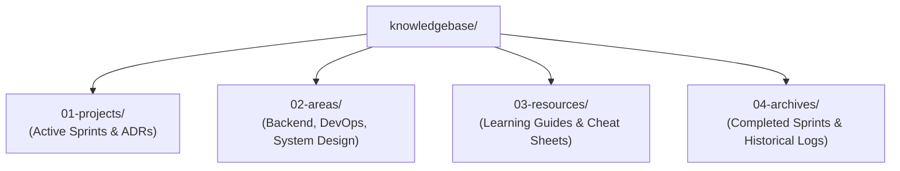

# 🧠 Master Knowledge Base & System Index

Welcome to the unified **Master Knowledge Base System**. This repository serves as the central hub for all technical architecture decision records (ADRs), active project sprints, how-to playbooks, and personal engineering goals.

---

## 🏛️ Knowledge Base Architecture (PARA + Diátaxis + ADR)

---

## 📂 Navigation Index

### 📁 `01-projects/` (Active Projects & Sprints)
* ⚡ **SignalFlow AI:** [`01-projects/signalflow-ai/sprint-board.md`](01-projects/signalflow-ai/sprint-board.md) — Intelligent Notification Filtering Mobile App, Pre-Selling Validation & Pitch Deck
* 🦔 **PostHog OSS Platform:** [`01-projects/posthog/sprint-board.md`](01-projects/posthog/sprint-board.md) — Enterprise COSS Contribution Tracker, Starter PR Targets & "Contribute-to-Hire" Roadmap
* 🏥 **Clinic App:** [`01-projects/clinic-app/sprint-board.md`](01-projects/clinic-app/sprint-board.md) — Active Sprint Goals, Task Backlog & Jane Migration Progress
* 🎵 **MusicLoopy Backend:** [`01-projects/musicloopy-backend/sprint-board.md`](01-projects/musicloopy-backend/sprint-board.md) — Active Sprint Board & Task Tracker
* 🔬 **Research Playground Loop:** [`01-projects/research-playground-loop/sprint-board.md`](01-projects/research-playground-loop/sprint-board.md) — Active Monorepo Sprint Goals & Sub-Projects
* 📜 **ADR Decision Ledger:** [`01-projects/adr/README.md`](01-projects/adr/README.md) — Index of Architecture Decision Records (ADR-001 through ADR-008)

### 📁 `02-areas/` (Technical Domains & Project Architecture)
* ⚡ **SignalFlow AI Architecture:** [`01-projects/signalflow-ai/README.md`](01-projects/signalflow-ai/README.md) — 3-Tier Notification Triage, On-Device Local NLP & SaaS Unit Economics
* 🦔 **PostHog System Architecture:** [`01-projects/posthog/architecture.md`](01-projects/posthog/architecture.md) — Event Ingestion (Rust/Kafka), ClickHouse OLAP, HogQL Engine, PersonHog Identity & 89+ Product Vertical Slices
* 🏥 **Clinic App Architecture:** [`02-areas/clinic-app/README.md`](02-areas/clinic-app/README.md) — FusionAuth SSO, Multi-Payer Split Billing, Dynamic RBAC, Jane Migration Hub & Reporting Analytics (EPIC-09)
* 🎵 **MusicLoopy Architecture:** [`02-areas/musicloopy-backend/README.md`](02-areas/musicloopy-backend/README.md) — Audio Looping Engine & Backend Architecture
* 🔬 **Research Playground Architecture:** [`02-areas/research-playground-loop/README.md`](02-areas/research-playground-loop/README.md) — Systems Architecture, Go/K8s/Rust Runtimes & CLI Operator

### 📁 `03-resources/` (Learning Library & Playbooks)
* 💡 [`03-resources/entrepreneurship/sell-before-building-playbook.md`](03-resources/entrepreneurship/sell-before-building-playbook.md) — Lean Startup "Sell Before Building" Playbook & Senior Investor Pitch Strategy
* 📖 [`03-resources/how-to-templates/how-to-template.md`](03-resources/how-to-templates/how-to-template.md) — Troubleshooting & How-To Guide Recipe Template
* 🎓 [`03-resources/learning-roadmap.md`](03-resources/learning-roadmap.md) — 30-Day Skill Matrix & Intellectual Exploration Plan

### 📁 `04-archives/` (Historical Records)
* 📦 [`04-archives/README.md`](04-archives/README.md) — Archive of Completed Sprints, Sunsetted Specs & Logs

---

## 🔗 Workspace Cross-References
* 🦔 **PostHog Monorepo:** `/home/shafikul/Documents/opensource_project/posthog`
* 🎯 **Enterprise OSS Discovery Engine:** `/home/shafikul/Documents/opensource_project`
* ⚡ **SignalFlow AI / Business Idea:** `/home/shafikul/Documents/business_idea`
* 🏥 **Clinic App Repository:** `/home/shafikul/Documents/office_work/clinic-app`
* 🔬 **Research Playground Loop:** `/home/shafikul/Documents/coding/research-playground-loop`
* 🎵 **MusicLoopy Backend:** `/home/shafikul/Documents/coding/musicloopy-backend`
